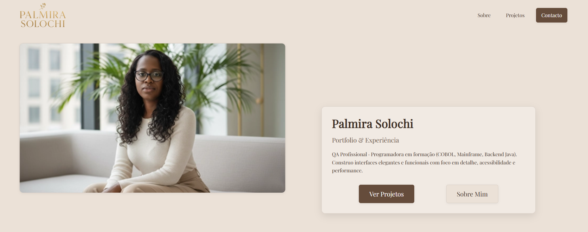
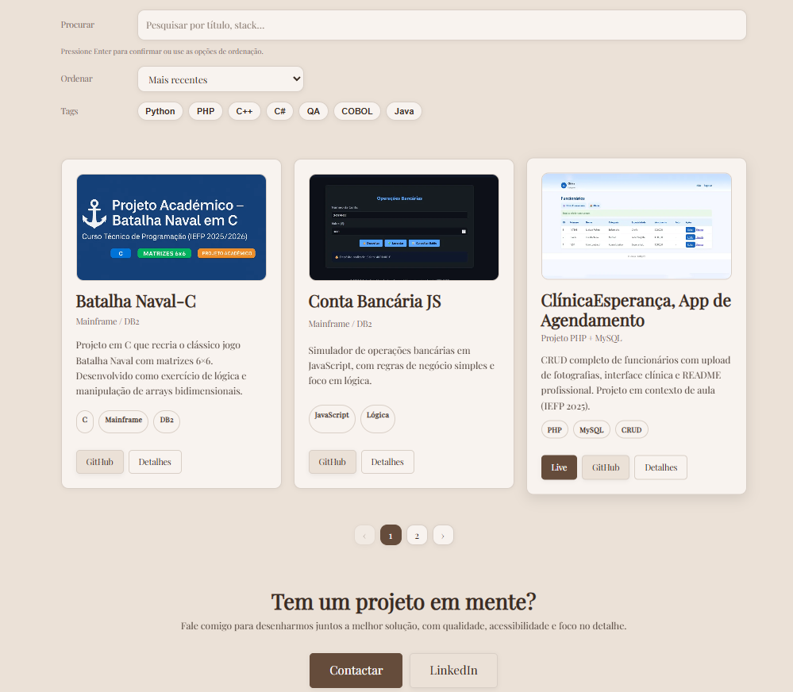
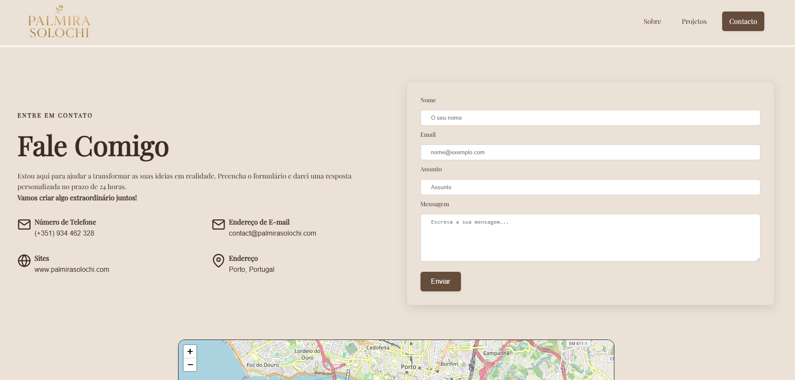

# 🌿 Palmira Solochi – Personal Portfolio Website


A modern, elegant and fast portfolio built with **React**, **Vite** and **TypeScript**, designed to present professional work with clarity, strong visuals and a smooth user experience.  
This project highlights clean component architecture, modular SCSS with BEM, reusable UI patterns and a fully responsive layout.

---

## 📌 Core Competencies  
This project demonstrates experience in:

- Frontend Architecture with React + TypeScript  
- Component-driven development  
- SCSS with strict BEM conventions  
- Clean reusable UI patterns  
- Responsive layout structure  
- UX-oriented interface decisions  
- API integration and service-layer separation  
- Semantic HTML and accessibility  

---

## 📸 Live Screenshots

### **Home Hero**


### **Projects Section**


### **Contact Section**


---

## 🧩 Project Overview

This repository contains the full source code for the **Palmira Solochi portfolio**, developed as a structured and scalable front-end application.  
The website is crafted with a focus on readability, reusability and visual quality.

Key goals of the project:

- Present professional content in a visually appealing and structured way  
- Maintain strong typography and branding consistency  
- Provide responsive design across desktop, tablet and mobile  
- Showcase modern front-end development skills with React + TypeScript  
- Use modular SCSS with BEM and strict file organization  
- Enable simple maintenance and future content expansion  

---

## 🛠️ Tech Stack

- **React 18**  
- **Vite**  
- **TypeScript**  
- **SCSS with BEM**  
- **Context API**  
- **Custom Fonts**  
- **Responsive Design**  
- **Semantic HTML**

---

## 🧱 Project Structure

```
src
├── assets/
├── components/
├── pages/
├── styles/
├── services/
├── types/
└── main.tsx
```

Structure ensures clarity, predictability and scalability.

---

## 🎨 Styling Strategy (SCSS + BEM)

All components follow strict BEM conventions with a maximum of three nesting levels.

Example:

```scss
.block {
  &__element {
    &--modifier {
    }
  }
}
```

---

## 🧠 Key Features

- Reusable UI system  
- Dynamic projects page with filters and pagination  
- Responsive typography and layout  
- Contact form with validation  
- Theme context ready  
- Full TypeScript strict mode  

---

## 🚀 Running the Project

```bash
npm install
npm run dev
npm run build
npm run preview
```

---

## 📁 Documentation & Screenshots

Files stored in:

```
docs/images
```

---

## 🤝 About the Creator

This project is part of my professional front-end developer portfolio, demonstrating attention to detail, clean code structure and modern UI development techniques.

---

## 📩 Contact

Email: your.email@example.com  
LinkedIn: https://linkedin.com/in/your-profile  
GitHub: https://github.com/your-user

---

### ⭐ If you find this project useful, consider giving it a star!
